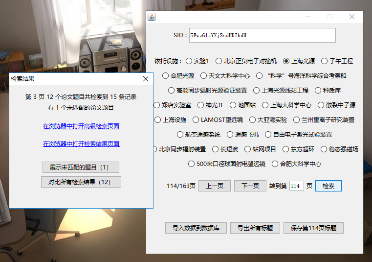
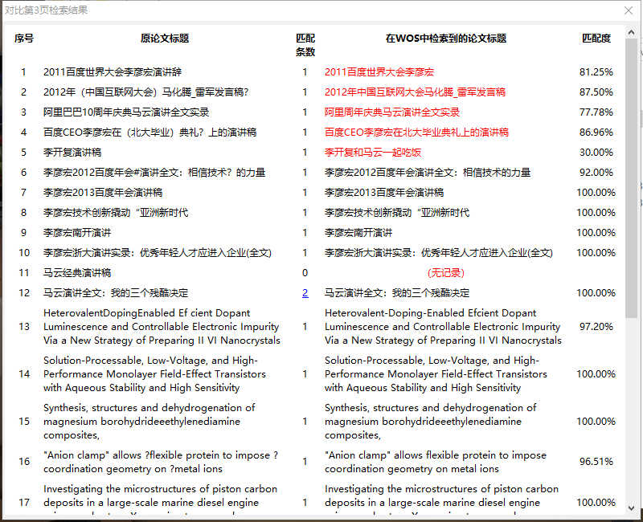

这是我一个在中国科学院大学读研的同学拜托我所做，他要用在 [中国科学院重大科技基础设施共享服务平台](http://lssf.cas.cn/cgjs_lb.jsp) 检索到的所有论文标题去 [Web of Science](http://www.isiknowledge.com) 网站检索论文，采集检索到的论文中的一些信息，由于这两个网站对同一篇论文录入的标题存在一些差异且第一个网站中的论文在第二个网站中基本都有，因此需要用第一个网站检索的论文标题去模糊匹配第二个网站的论文，并对这两个网站检索到的论文标题进行对比展示，这些所有的操作都在后台进行，最后只是展示论文标题对比结果和在浏览器打开 Web of Science 网站检索的论文结果页面。

由于 [Web of Science](http://www.isiknowledge.com) 网站要通过漫游功能登录，必须最近曾于所在相关机构处进行过登录，而我写完这个程序已经有很长一段时间了，当时测试也是我那个同学给我的权限，所以下图中展示的内容只是模拟的测试数据并非网站上检索的内容。

